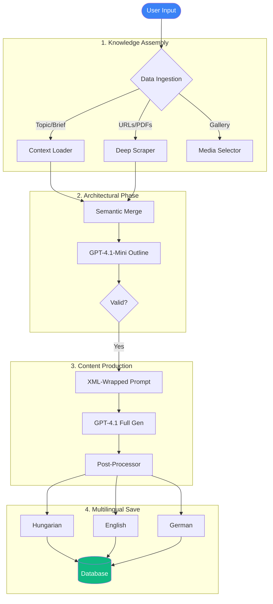
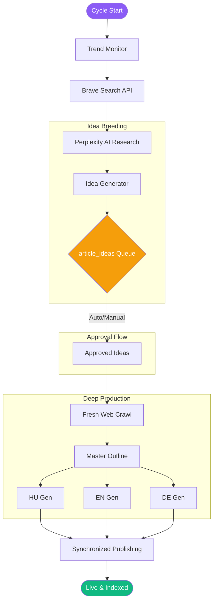
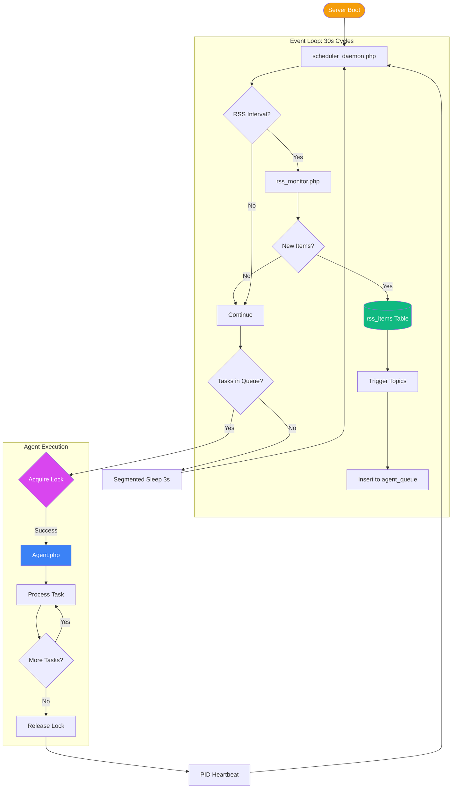
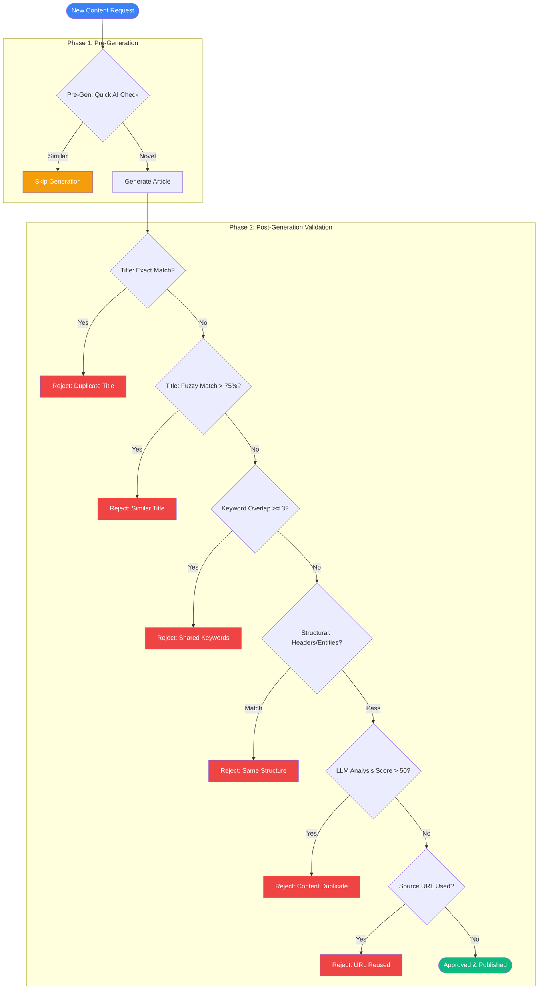

# 🤖 AI Blog Engine

[](https://www.paypal.com/ncp/payment/KUM7TUZW4CNPN)

**AI Blog Engine** is a state-of-the-art, self-hosted PHP automation platform designed for building high-authority niche sites. It doesn't just "generate text"—it **researches, architects, and maintains** a semantic niche ecosystem using advanced multi-agent orchestration.

🌐 **Live Demo**: [https://hungaryvfr.hu/aiblog/](https://hungaryvfr.hu/aiblog/) – See the engine in action!

---

## 🧠 Smart AI Model Strategy

The system uses a triple-layered AI model strategy to optimize for speed, intelligence, and cost-efficiency:

| Model | Role | Use Case |
|-------|------|----------|
| **GPT-4.1-Nano** | Decision Maker | Fast routing, trend analysis, source validation |
| **GPT-4.1-Mini** | Architect | Content outlines, summaries, structural plans |
| **GPT-4.1** | Craftsman | High-quality prose, complex reasoning, final articles |

**OpenAI API Tier Management:**
The engine automatically detects your OpenAI API tier (Free → Tier 1 → Tier 2 → Tier 3 → Tier 4 → Tier 5) and configures rate limits accordingly:
- **Auto-Detection**: On first run or via the "Detect Tier" button, the system queries your OpenAI account limits and selects the appropriate tier.
- **Manual Override**: You can manually select a tier from the Admin Settings panel if auto-detection doesn't match your setup.
- **Adaptive Limits**: Each tier sets TPM (tokens/min), RPM (requests/min), and max content length to prevent API throttling.

---

## 📦 Installation

1.  Upload the project files to your web server.
2.  Navigate to `/install/setup.php` in your browser.
3.  The setup wizard will:
    - Create all required database tables.
    - Configure your `.env` file with database credentials and API keys.
    - Set the **default interface language** and **content generation languages**.
4.  After setup, delete the `/install/` folder for security.

**Multilingual Support:**
During setup, you select the default language for the admin interface. The system supports **Hungarian (HU)**, **English (EN)**, and **German (DE)** for content generation. These languages can be individually enabled or disabled at any time via the Admin Settings panel.

---

## 🚀 Content Generation Pipelines

### 1. Manual Creation Pipeline (`admin_create`)



**Technical Details:**
- **Context Injection**: Merges topic-specific keywords, writing styles, and semantic entities into a unified prompt.
- **Deep Scrape**: Custom cURL wrapper that extracts structured text from URLs while stripping JS/CSS noise.
- **XML-Wrapped Prompting**: Prevents hallucinations by encapsulating user data in strict XML schemas.
- **Multilingual Sync**: All three language versions are generated from the same master outline for semantic consistency.

---

### 2. Autonomous "Autopilot" Workflow



**Step-by-Step Logic:**
1.  **Trend Monitoring**: Scans the web for "Top Mentions" and "Spiking Queries" in your niche via Brave Search.
2.  **Research Synthesis**: Perplexity AI creates a **Knowledge Brief** with factual data points and extracted sources.
3.  **Idea Breeding**: The AI proposes unique article titles and angles based on research findings.
4.  **Cross-Language Sync**: All language versions are generated from the *same* master outline to ensure semantic consistency.

---

### 3. Background Operational Layer (Daemon & Workers)



**Operational Excellence:**
- **RSS Flow**: `rss_monitor.php` scans feeds → inserts new items to `rss_items` → triggers affected topics → creates `agent_queue` entries for each language.
- **Lock Management**: `LockManager.php` prevents race conditions between auto and manual runs.
- **Memory Safety**: Uses `gc_collect_cycles` every loop for month-long uptime without leaks.
- **Ghost Protection**: PID tracking ensures only one daemon instance is active, even after crashes.

---

## 🛠️ Advanced Features

### 🖼️ Integrated Gallery Management
- **Topic-Based Universes**: Images are siloed into specific category galleries.
- **Managed Assets**: Users can manually curate high-quality visuals for specific categories.
- **Smart Suggestions**: Images used in generated posts are tracked and can be promoted to the permanent gallery.

### 🛡️ Similarity & Uniqueness Guard



**Two-Phase Validation:**
1.  **Pre-Generation (Quick AI Check)**: Before writing, the gathered research is compared against recent posts to avoid wasted API calls.
2.  **Post-Generation (6-Tier Validation)**:
    *   **Title Exact Match**: Rejects if title already exists.
    *   **Title Fuzzy Match**: Rejects if >75% similar (Levenshtein).
    *   **Keyword Overlap**: Rejects if 3+ significant words shared.
    *   **Structural Similarity**: Checks H2/H3 headers and entity overlap.
    *   **LLM Content Analysis**: AI scores content similarity (0-100), rejects if ≥50.
    *   **Source Reuse Block**: Ensures URLs aren't cited repeatedly.

> **⚙️ Configurable**: All similarity thresholds (fuzzy match %, keyword count, LLM score limit, etc.) are fully customizable via the Admin Settings panel.

### 💬 AI-Powered Comment Moderation
- **Autonomous Filtering**: Every comment is analyzed for spam, trolls, or toxic content.
- **Context-Aware Auto-Replies** *(Optional)*: The AI can automatically respond to user questions. This feature can be enabled/disabled via the Admin Settings panel.
- **Source Suggestion**: When a user shares a URL in their comment, the AI analyzes the link's relevance to the blog's topics. If deemed valuable, it creates a proposal in the admin dashboard to add the URL as a permanent research source for future article generation.

### 🔔 Web Push & PWA
- **Native Notifications**: Send push alerts directly to users' browsers when new content is published.
- **Progressive Web App**: Install the blog as a standalone app on iOS and Android.
- **VAPID Security**: Uses secure ECDH encryption for all notification payloads.

### 📈 Privacy-First Analytics
- **Zero-3rd-Party Tracking**: Lightweight, built-in analytics for views and engagement.
- **Cookie-less**: Anonymous identification techniques protect user privacy.
- **Real-time Stats**: Instant dashboard updates for page views, topic distribution, and source performance.

### ⚙️ Admin Settings Panel
The admin interface provides granular control over all AI and security settings:

**🔊 Voice Selection (TTS):**
Choose from 6 OpenAI voices for text-to-speech audio generation: *Alloy, Echo, Fable, Onyx, Nova, Shimmer*. Test buttons let you preview each voice in all supported languages. In the **Post Editor** (`admin_edit`), you can generate an audio transcript of the article using the selected voice – the audio file is saved and can be embedded directly in the post for visitors to listen.

**🛡️ reCAPTCHA v3:**
Protect your login and comment forms with Google reCAPTCHA v3. Simply paste your Site Key and Secret Key to enable invisible bot protection.

**🤖 Triple-Layered AI Models:**
Customize which GPT model handles each task type:
- **Agent Model**: Controls decision-making (default: gpt-4.1-nano)
- **Draft Model**: Handles outlines and summaries (default: gpt-4.1-mini)
- **Final Model**: Produces the complete article (default: gpt-4.1)

**🎛️ GPT Generation Parameters:**
Fine-tune AI output with slider controls:
- **Max Tokens**: 1,024 – 16,384 (controls article length)
- **Temperature**: 0.0 – 2.0 (creativity vs. determinism)
- **Presence Penalty**: -2.0 – 2.0 (topic diversity)
- **Frequency Penalty**: -2.0 – 2.0 (word repetition control)

### ✏️ Post Editor (`admin_edit`)
Every generated article can be manually refined using a full-featured editor:
- **TinyMCE Integration**: Professional WYSIWYG editor with formatting toolbar (headings, lists, links, embeds).
- **In-Editor Gallery**: A dedicated gallery button opens the topic's image collection, allowing one-click image insertion directly into the content.
- **Hero Image Selector**: Quickly swap the featured image from the topic gallery or enter a custom URL.

---

## 🏗️ Deployment

The engine supports two background execution modes, automatically selected based on your server's capabilities:

**Automatic Mode Detection:**
- The admin interface checks if `exec()` and `popen()` are available on your server.
- **If supported**: The system uses **Daemon Mode** – a persistent PHP process that runs 24/7, managed via Start/Stop buttons in the admin panel.
- **If not supported**: The system falls back to **Cron Mode** – you must set up a system cron job to periodically trigger the agent.

**Manual Override:**
If `exec()` is available but you prefer cron-based scheduling (e.g., for shared hosting stability), you can manually switch modes in the Admin Settings panel.

### Daemon Mode (Recommended)
**No cron required!** The system handles everything automatically. Simply click the **Start** button in the admin panel to launch the background daemon – no command-line access needed.

### Cron Mode (Fallback)
If your server doesn't support `exec()`, the admin panel displays the required cron command:
```bash
# Add to your server's crontab (recommended: every 30 minutes)
*/30 * * * * php /path/to/project/cron/cron_runner.php
```

---

## ☕ Support the Project

[](https://www.paypal.com/ncp/payment/KUM7TUZW4CNPN)

---

## 📄 License

Developed with ❤️ by [darealgege](https://github.com/darealgege).  
Licensed under the MIT License.
